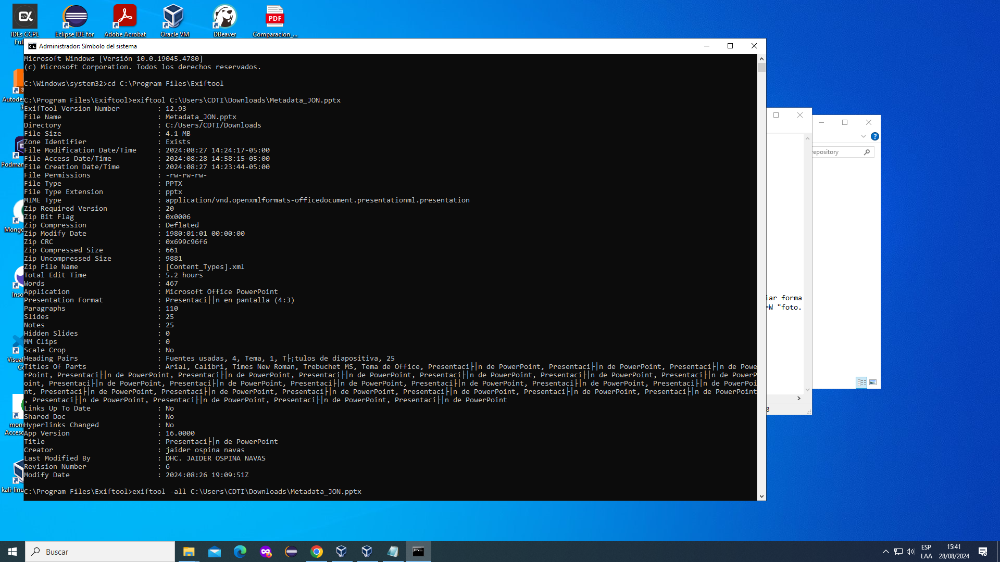
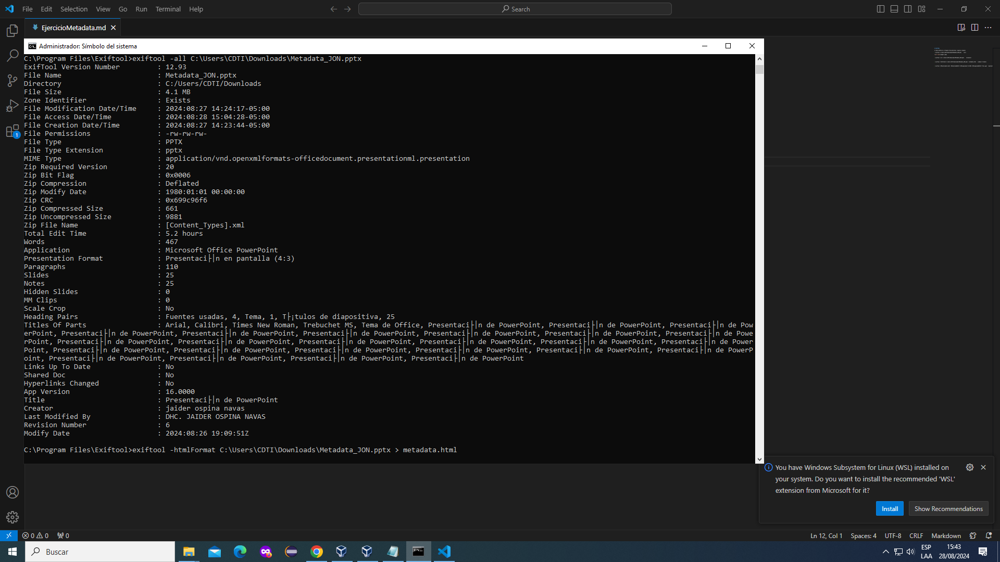
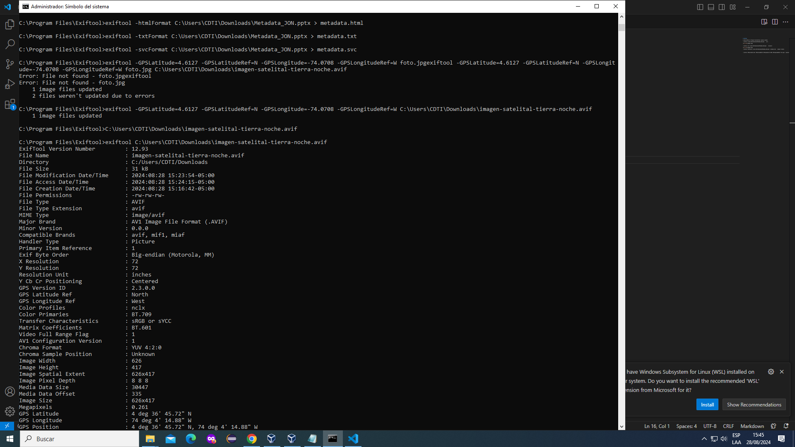

# EXIFTOOL

C:\Users\CDTI>cd C:\Program Files\Exiftool (ingreso carpeta)

> exiftool C:\Users\CDTI\Downloads\Metadata_JON.pptx    (ver)

> exiftool -all C:\Users\CDTI\Downloads\Metadata_JON.pptx    (eliminar)

> exiftool -htmlFormat C:\Users\CDTI\Downloads\Metadata_JON.pptx > metadata.html   (cambiar formato)

> exiftool -GPSLatitude=4.6127 -GPSLatitudeRef=N -GPSLongitude=-74.0708 -GPSLongitudeRef=W "foto.jpg"  (ingresar datos de geolocalizacion a imagen)

